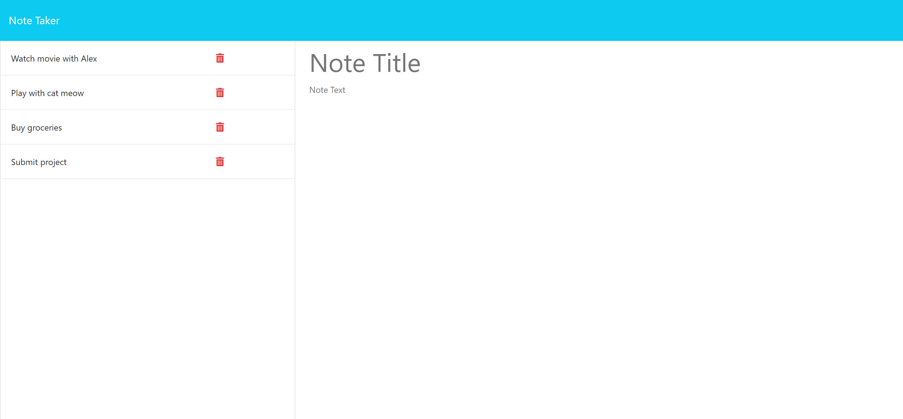

# Express.js Note Taker

[](https://opensource.org/licenses/MIT)

## Description
Express Note Taker is a simple application designed to help users write and save notes. It utilizes an Express.js back end to save and retrieve note data from a JSON file. The application provides a user-friendly interface for organizing thoughts and keeping track of tasks.

### Problem Solving
Express Note Taker addresses the need for a lightweight note-taking application that can be easily deployed and accessed from any device. By leveraging Express.js and JSON file storage, the application offers a straightforward solution for managing notes.

### Learning
I gained experience in building a back end for a web application using Express.js. I learned how to create routes to handle HTTP requests, interact with file storage, and manage data persistence. Additionally, the project enhances skills in HTML, CSS, and client-server communication.

## Table of Contents
- [Installation](#installation)
- [Usage](#usage)
- [Deployed Application to Heroku Link](#deployed-application-to-heroku-link)
- [License](#license)
- [Questions](#questions)
- [How To Contribute](#how-to-contribute)

## Installation
To install and run this project locally, follow these steps:

1. Clone the repository to your local machine.
    
    ```git clone git@github.com:jodielee062788/express_note_taker.git```

2. Open the project folder in your code editor.

3. Install dependencies using npm.

    ```npm install```

4. Run the application using Node.js.

    ```node server.js```

5. Open your web browser and navigate to:

    ```http://localhost:3001``` 

## Deployed Application to Heroku Link

[Express.js Note Taker]()

## Usage

1. Upon opening the application, you will be presented with a landing page with a link to the notes page.
  
    

2. Click on the "Get Started" button or the "Note Taker" link to access the notes page.

    

3. On the notes page, you will see existing notes listed on the left-hand side and fields to enter a new note on the right-hand side.

    

4. To create a new note, enter a title and content for the note in the provided fields.

    

5. Click the "Save Note" button to save the note. The saved note will appear in the list of existing notes.

    

6. Click the "Clear Form" button to clear the content of the note.

    

6. To view or edit an existing note, click on the note title in the list. The note content will be displayed in the right-hand side fields.

    

7. To delete a note, click on the trash icon next to the note in the list.

    

## License
This project is licensed under the MIT license. See the [LICENSE](./LICENSE) file for details.

## Questions
For any questions or inquiries, please feel free to reach out to me via email at jodielee062788@gmail.com. 
You can also find me on GitHub: [jodielee062788](https://github.com/jodielee062788)
  
## How To Contribute
If you'd like to contribute to this project, please follow these guidelines:
1. Fork the repository to your GitHub account.
2. Clone the forked repository to your local machine.
3. Create a new branch for your feature or bug fix.
4. Make your changes and commit them with descriptive commit messages.
5. Submit a pull request.
